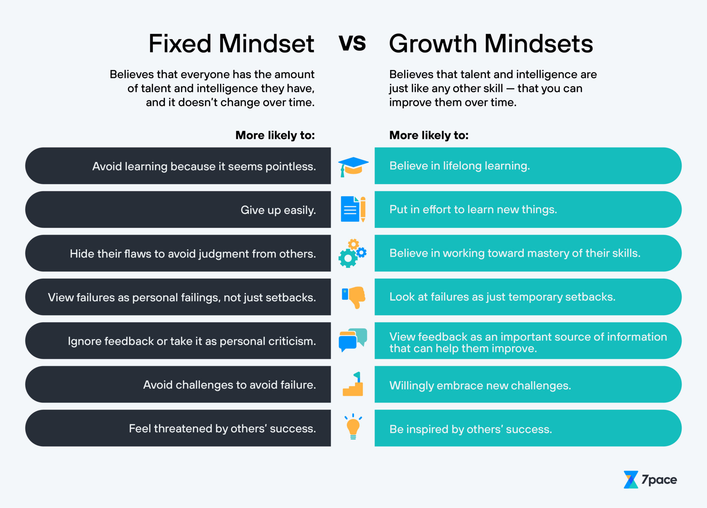
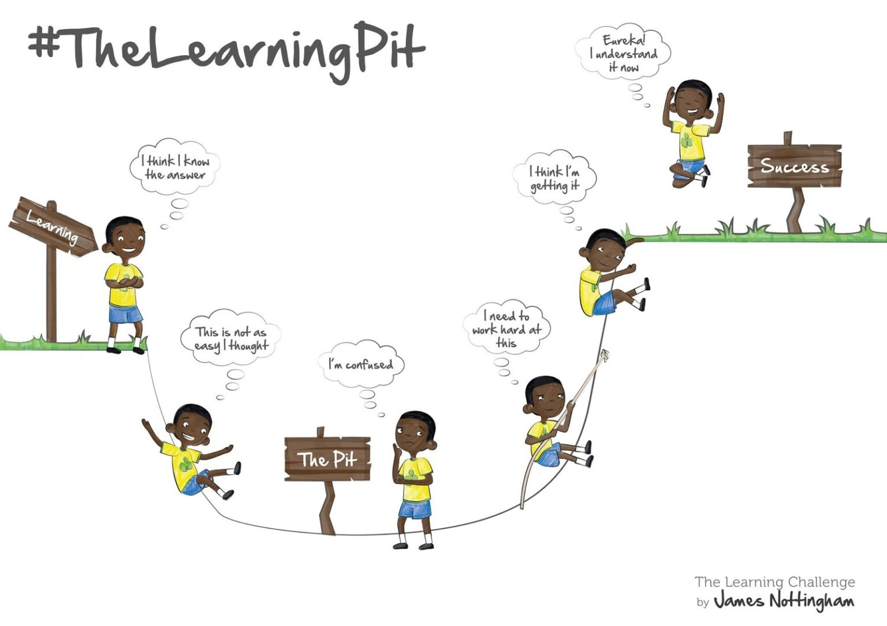

# About Me

Hi! I'm Joe Venton and I'm currently studying with [Tech Educators Norwich](https://techeducators.co.uk).  
I'm enrolled on their 10-week full-stack coding course, looking to gain some skills and experience to allow me to find employment as a developer.  
I haven't got any previous experience in coding but I'm **very** eager to learn!  
My public GitHub repositories can be found [here](https://github.com/RealGUppercut).

My profile picture is a character called ***Purple Tentacle*** from a video game I loved as a child, [Day of the Tentacle](https://en.wikipedia.org/wiki/Day_of_the_Tentacle).

This is also due to the fact that there aren't any pictures of me taken in the last 10 years where I look better than a weird, slimy tentacle guy.

---
# Links to reading notes:  

### Course 102  

- [Class 01 - Markdown](/102/102notes-01.md)  
- [Class 02 - The Coders Computer](/102/102notes-02.md)  
- [Class 03 - Revisions and the Cloud](/102/102notes-03.md)  
- [Class 04 - Structuring web pages with HTML](/102/102notes-04.md)  
- [Class 05 - Designing Webpages with CSS](/102/102notes-05.md)  
- [Class 06 - Dynamic Web Pages with Javascript](/102/102notes-06-javascript.md) 
- [Class 07 - Programming with Javascript](/102/102notes-07.md)  
- [Class 08 - Operators and Loops](/102/102notes-08.md)  

### Course 201  
  
- [Class 01](/201/201notes-01.md)  
- [Class 02](/201/201notes-02.md)  
- [Class 03](/201/201notes-03.md)  
- [Class 04](/201/201notes-04.md)  
- [Class 05](/201/201notes-05.md)  
- [Class 06](/201/201notes-06.md)  
- [Class 07](/201/201notes-07.md)  
- [Class 08](/201/201notes-08.md)  
- [Class 09](/201/201notes-09.md)  
- [Class 10](/201/201notes-10.md)  
- [Class 11](/201/201notes-11.md)  
- [Class 12](/201/201notes-12.md)  
- [Class 13](/201/201notes-13.md)  
- [Class 14](/201/201notes-14.md)  
- [Class 15](/201/201notes-15.md)  

---

# Maintaining a Growth Mindset during this course:
### What is a Growth Mindset?
+ A Growth Mindset is a way of approaching the process of learning new skills.  
+ Firstly accepting a **flexible** attitude to personal progress (specifically that an individuals capacity for learning is never static), means that learning is achievable for *everyone* when effort is applied over time.
+ Learners accept that the are obstacles that will be encountered during education are temporary. By fully embracing the idea that an individuals skills will improve over time, a learner will be able to process and overcome various negative feelings they may experience.  

This image demonstrates how a **Growth Mindset** can help to overcome some common obstacles to learning resulting from a **Fixed Mindset**:  
   

### How will I try to adopt a Growth Mindset?
+ #### Managing feelings of inadequecy
I will remind myself that I am more than capable of **learning**.  
I will remember **The Learning Pit** and recall previous times when learning new concepts has been difficult but I have eventually succeeded.  

+ #### Being mindful of what has been achieved so far
At the time of writing this page, I have been studying for two days.  
I am pleased with the progress I have made so far so there isn't any reason why this won't continue throughout the course.  

+ #### Being prepared to encounter new topics  
Reading ahead in the course material will help me avoid feeling overwhelmed when a lot of new information is presented over a short amount of time.
